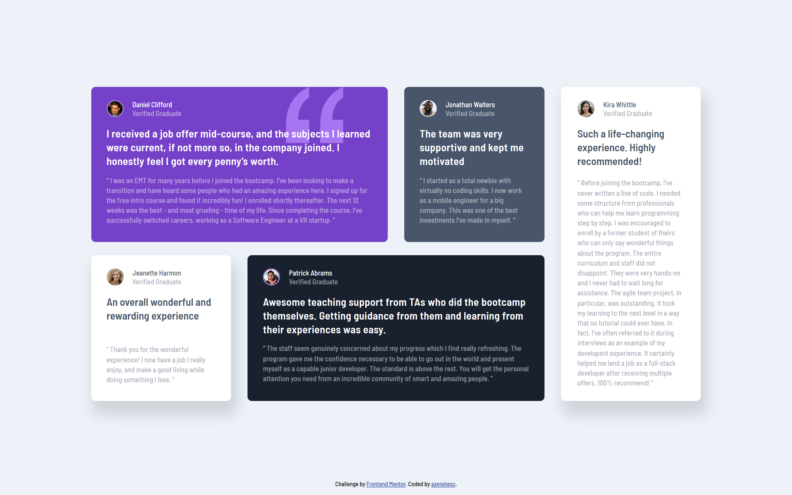

# Frontend Mentor - Testimonials grid section solution

This is a solution to the [Testimonials grid section challenge on Frontend Mentor](https://www.frontendmentor.io/challenges/testimonials-grid-section-Nnw6J7Un7).

## Table of contents

- [Overview](#overview)
  - [Screenshot](#screenshot)
  - [Links](#links)
- [My process](#my-process)
  - [Built with](#built-with)
  - [Useful resources](#useful-resources)
- [Author](#author)

## Overview

### Screenshot

  <h3>My solution</h3> 

### Links

- Solution URL: [FrontEnd Mentor: My Solution](https://github.com/azenetesc/testimonial-grid)
- Live Site URL: [GitHub Page: NFT Preview Card](https://azenetesc.github.io/testimonial-grid/)

## My process

### Built with

- Semantic HTML5 markup
- SASS
- CSS Grid
- Flexbox
- Mobile-first workflow

### Useful resources

- [CSS-Tricks: A Complete Guide to Grid](https://css-tricks.com/snippets/css/complete-guide-grid/) - This helped me with all my doubts about grid
- [Kevin Powell: CSS Grid Made Simple](https://www.youtube.com/watch?v=_lEkD8IGkwo&pp=ugMICgJlcxABGAE%3D) - Kevin Powell explains grid in the easiest way possible

## Author

- Frontend Mentor - [@azenetesc](https://www.frontendmentor.io/profile/azenetesc)
